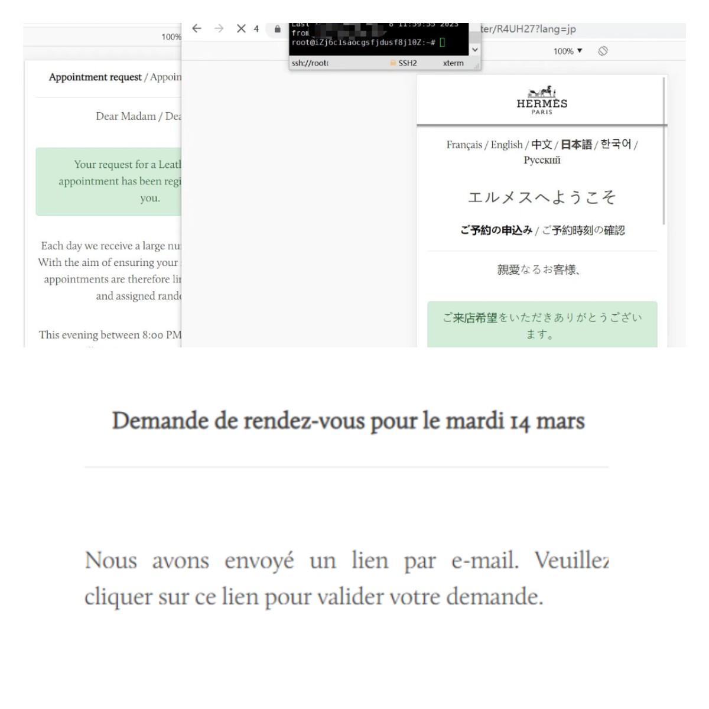
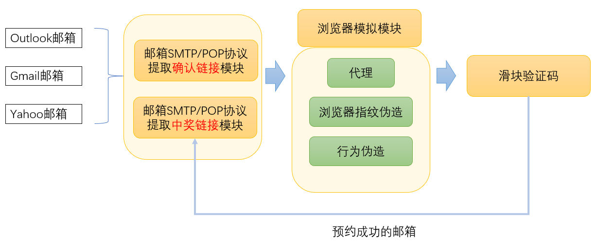

# Datadome-Hermes-Bypass-Research

因为朋友介绍，在2023年01-03月期间断断续续帮一位法国的朋友在爱马仕官网[https://rendezvousparis.hermes.com/client/register](https://rendezvousparis.hermes.com/client/register)进行预约，因为爱马仕风控策略一直在调整，所以我也跟踪研究了一段时间，最终实现绕过Datadome风控的浏览器版本和协议版本的完整程序。

最近由于忙于其他事情暂时不自己进行这个活动的预约了，目前仅在该仓库公开基础的浏览器demo和一些技术分享，欢迎对浏览器完整版本或者协议版本脚本有需要的朋友可以进一步加我微信h88088abc交流，如果无需要请勿打扰谢谢。

本仓库提供的内容仅供研究JS逆向学习交流使用，请勿用于任何违法用途。

### 爱马仕风控分析

经过作者第一季度的跟踪研究，hermes风控团队算是有点技术实力，他们风控策略是在动态调整的，一般几周就会更新策略，所以如果要在https://rendezvousparis.hermes.com/client/welcome活动主页进行预约，需要技术人员定期维护相关的程序，本仓库的程序实测在2023.04.10前都是有效的。

该活动中奖与否很大程度取决于你的预约成功的账户数量，因为抽奖是概率制，越多账号预约上雨而已中。

#### （1)初期阶段，浏览器绕过

由于普通用户都是通过浏览器进行预约，因此先采用模拟的方式看能否进行操作。最终实现批量的自动化注册，几个核心需要突破的点：

- 绕过Datadome前端对浏览器指纹的检测
- 绕过Datadome后端对访问行为、IP地址的检测
- 绕过Google验证码
- 提高账户信息可信度

仓库会提供一个打包后的通过浏览器自动化访问register页面的demo（稍后上传），并且可能会提供一个配置文件设计你的任何自动化操作过程，并且自带绕过google验证码和atadome风控的模块，欢迎测试反馈。

#### （2)中期阶段，浏览器优化

虽然爱马仕官网说活动是抽奖制度，但是在作者实际测试的过程发现有段时间预约进池子越早越容易中奖。

而且因为预约的人越来越多，后来需要提高账户的数量，这样单进程的浏览器自动化操作并不能满足预约的速度和需求，因为官方有风控，访问速度又不能太快。于是我将浏览器打包成一个得到绕过风控的API接口，分布式部署在10+台服务器上，通过代理批量获取通过验证码和datadome风控验证过的cookie，然后再通过requests库携带请求register接口，最终实现10分钟预约2000-8000账户，后来降低了速率并提高了账户进一步提升到30分钟预约10000-20000账户。

但只有register是不够的，爱马仕要求在一段时间后在邮件确认通过，因此还需要一个程序来完成这部分操作，程序架构如下：

1：实测爱马仕风控在早期只有点击了确认链接都算，后来发现有一段时间需要在5-10分钟内点击。

2：而且早期爱马仕这个确认链接是有办法不触发滑块就预约成功的，但是后来官方改进了风控必须要通过滑块验证码，因此在我在上述程序后面加上了一个滑块操作模块。

3：这部分对速率要求不高，浏览器实现，最终确认链接点击成功效果如下左图，失败如右图所示

#### （3)最终杀器，协议版本

在三月份的时候很意外发现，爱马仕这个活动取消了google验证码，那岂不是可以全协议流程走一遍？！之前没时间去仔细研究google的验证码协议所以用的是yes captcha实现识别。

datadome主要通过tag.js在客户端检测并且提取了指纹交给后台检测，爱马仕用的版本是version 4.6.16，研究js脚本发现，混淆程度并不复杂，这里提供一个解字符串混淆的脚本如decrypt.py。一旦服务器验证了你的数据就会提供一个可以合法的cookie，就可以requets多进程或者多服务器分布式请求，效率远远高于浏览器。

因为协议脚本后来卖个了一个朋友老板，暂时不会在互联网公开，也协商在4.21前暂时不对外出售，之后如果有需要可以联系我。更多的datadome分析过程未来有时间再详细分享。

> 另外，如果google验证码又出现了的话，可以将验证码的打码专门接入我的浏览器运行的API接口处理，其他环节依旧采用协议请求。

### 一些对外售卖的程序

- 解混淆的datadome tag.js version 4.6.16  600元
- 协议版本请求welcome和register的demo 1000元
- 浏览器绕过datadome和google验证码的打包程序API或者源码 2000元
- python3.8通过requests + threading等库实现的完整协议流程  20000元
- 邮箱浏览器确认链接自动提取和访问（浏览器版本）800元
- 此外点击邮箱的确认链接已经通过协议实现，但是因为官方要触发滑块验证码，暂时没有去逆向，如果有需要欢迎告知（需要预付费一部分）
- 其他需要帮忙解决的技术bug，不讨论datadome技术，但是如果你想交流安全基础技术，随时欢迎~~

### 感想

风控对抗需要长期研究，形成完整的解决方案，而且有时间我希望能对google验证码进行协议分析绕过。

近期在忙着研究安卓逆向，包括flutter关键函数定位工具的开发还有一些秒杀的任务，以后有机会再分享~

